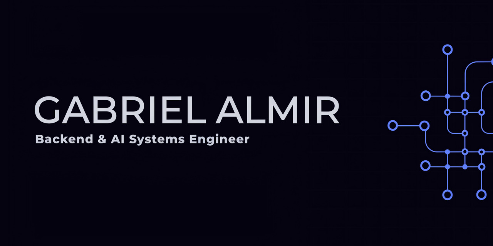

<h1 align="center">Gabriel Almir</h1>

<strong>Systems Analyst · Backend &amp; AI Systems</strong> 
TypeScript / Node.js • Python • ERP Integrations • Regulated Systems

  
  
  

## About

I build backend systems and integrations where **traceability, consistency and operational continuity** are real product requirements.

My work is centered on **Node.js, TypeScript and Python**, with experience in ERP integrations (SAP/TOTVS), APIs, data flows and regulated environments (BPF/GMP). I am expanding this foundation into **AI systems**: model integration, MCP, evaluation, guardrails, observability and secure operation.

I work as a Systems Analyst at **Laboratório Cristália** in the pharmaceutical sector. I contributed to the evolution of [PhotoGIMP](https://github.com/Diolinux/PhotoGIMP) and today take part in organizing and reviewing the project.

## Selected work

| Project | What it demonstrates |
| --- | --- |
| [Pimbas](https://github.com/gabrielalmir/pimbas) | Architectural evolution: domain modeling, contract preservation during migration, per-group data isolation. |
| [Saturno](https://github.com/gabrielalmir/saturno) | Product architecture: a modern Laravel/Inertia monolith with a modular boundary instead of premature distribution. |
| [Maybe](https://github.com/gabrielalmir/maybe) | Errors and absence as explicit states, adopted incrementally at the edges of PHP 7.4 systems. |
| [Hush](https://github.com/gabrielalmir/hush) | RESP-compatible server: what concurrency, memory and TTL semantics have to make explicit. |
| [MCP AnimagineXL](https://github.com/gabrielalmir/mcp-animaginexl) | Applied AI engineering: exposing image generation over MCP and REST without hiding the GPU boundary. |

More dossiers and labs — including [Resulta](https://github.com/gabrielalmir/resulta), [Astrum](https://github.com/gabrielalmir/astrum) and [D4Sign Node](https://github.com/gabrielalmir/d4sign-node) — at [gabrielalmir.com.br](https://gabrielalmir.com.br).

## Engineering principles

- Start from the domain and make trade-offs explicit.
- Prefer reproducible systems: tests, documented decisions, containers and clear operational limits.
- Treat AI as a system component that needs evaluation, access control, observability and human review — not as magic.
- Keep sensitive data, internal processes and credentials out of public repositories.

## Current focus

**Q3 2026** — evaluation and guardrails for MCP servers; reporting pipelines over multiple databases.

- Reliable AI integrations with MCP, structured outputs and evaluation.
- Backend architecture for regulated and integration-heavy domains.
- Clear technical writing: architecture dossiers, limits and measurable outcomes.

## Stack

`TypeScript` · `Node.js` · `Python` · `NestJS` · `Fastify` · `PostgreSQL` · `Redis` · `Docker` · `AWS` · `GitHub Actions`

> "Não leio livros sobre o mundo. Saio por aí e vejo por mim mesmo." — Ezreal
