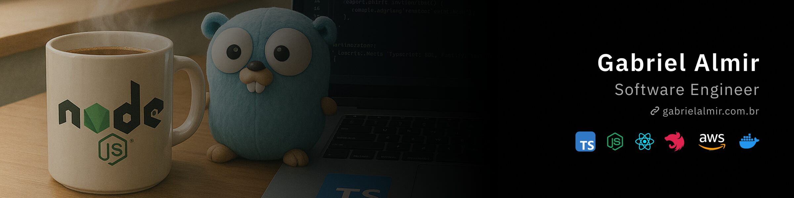

<h1 align="center">Gabriel Almir</h1>

  <strong>Backend Developer</strong> 
  Node.js • TypeScript • NestJS • Python • AI

  
  
  

  

---

## 💫 About Me

Backend developer with several years of experience building APIs and backend systems using **Node.js**.  
Strong background in **microservices**, **event-driven systems**, and **integration architecture**.

Currently working at **Laboratório Cristália**, contributing to the evolution of solutions for the **pharmaceutical sector**, focusing on scalability, reliability, and compliance.

## 🌐 Socials

  
  
  
  

---

## 💻 Tech Stack

  

---

  <i>"Não leio livros sobre o mundo. Saio por aí e vejo por mim mesmo." — Ezreal</i>

