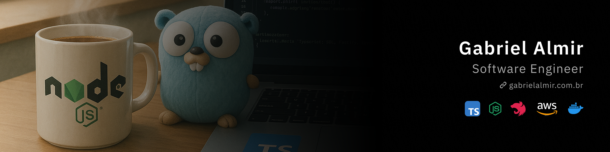

## Hi! I'm Gabriel Almir!
### Software Engineer | Backend Developer
#### Node.js, TypeScript, NestJS, Fastify, Next.js, React.js, Docker & AWS

I am a Backend Developer with extensive experience in **Node.js**, specializing in building scalable, high-performance, and maintainable systems. I thrive on developing clean and efficient architectures, following best practices such as **Clean Architecture, SOLID principles, and Design Patterns**.

With a strong background in **microservices, RESTful APIs, and database integrations (SQL & NoSQL)**, I am passionate about delivering business-driven solutions while ensuring technical excellence. I also have hands-on experience with **containerization (Docker, Kubernetes) and cloud computing (AWS, Terraform)**, enabling optimized deployments and seamless scalability.

### Technologies I Work With

  
  
  
  
  
  
  
  
  
  
  
  
  
  
  
  
  
  
  
  
  
  
  
  
  
  
  

### Get in Touch

  
  
  

