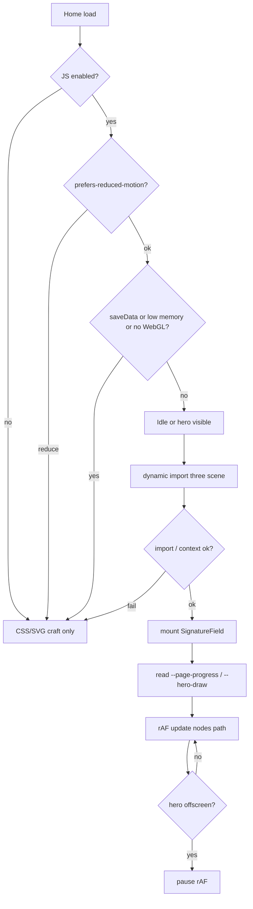
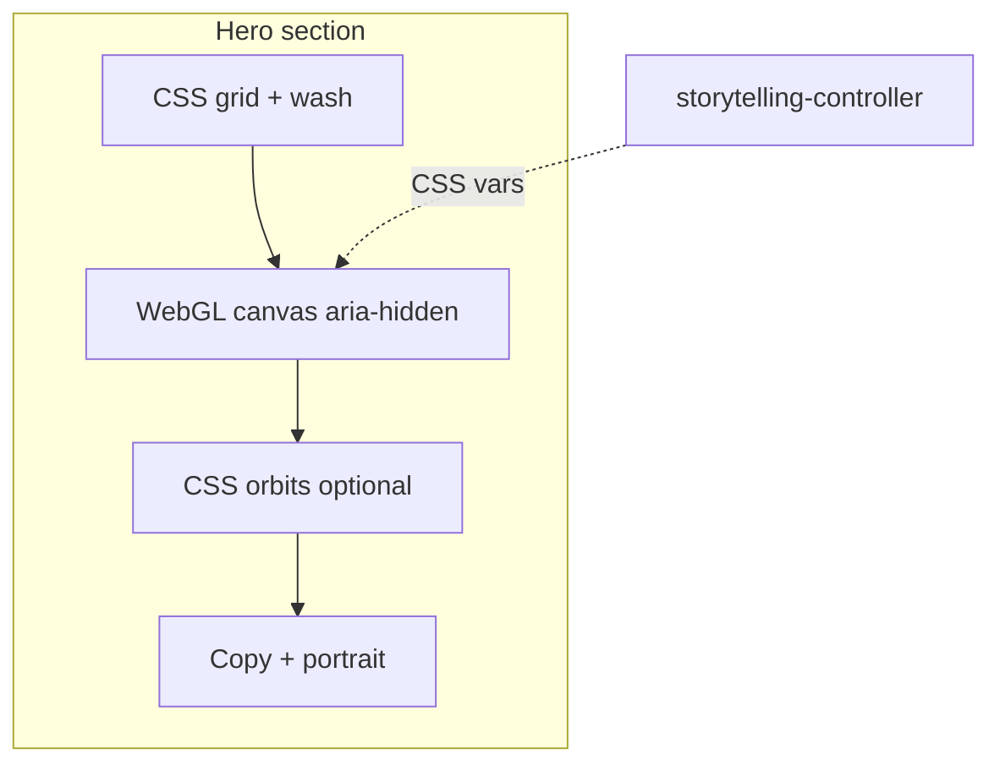
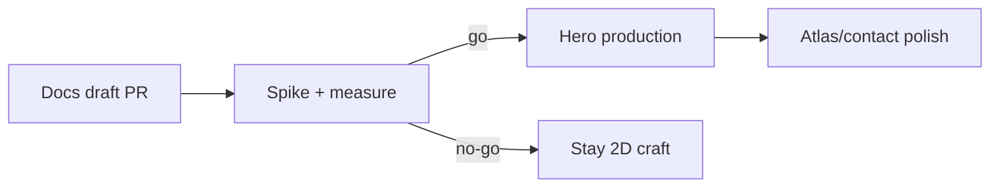

# Three.js signature layer — flows

## Runtime decision

```mermaid
flowchart TD
  A[Home load] --> B{JS enabled?}
  B -->|no| Z[CSS/SVG craft only]
  B -->|yes| C{prefers-reduced-motion?}
  C -->|reduce| Z
  C -->|ok| D{saveData or low memory or no WebGL?}
  D -->|yes| Z
  D -->|no| E[Idle or hero visible]
  E --> F[dynamic import three scene]
  F --> G{import / context ok?}
  G -->|fail| Z
  G -->|ok| H[mount SignatureField]
  H --> I[read --page-progress / --hero-draw]
  I --> J[rAF update nodes path]
  J --> K{hero offscreen?}
  K -->|yes| L[pause rAF]
  K -->|no| J
```

## Layering

```mermaid
flowchart TB
  subgraph hero [Hero section]
    back[CSS grid + wash]
    webgl[WebGL canvas aria-hidden]
    mid[CSS orbits optional]
    fore[Copy + portrait]
  end
  back --> webgl --> mid --> fore
  scroll[storytelling-controller] -.->|CSS vars| webgl
```

## Delivery phases

```mermaid
flowchart LR
  P0[Docs draft PR] --> P1[Spike + measure]
  P1 -->|go| P2[Hero production]
  P1 -->|no-go| X[Stay 2D craft]
  P2 --> P3[Atlas/contact polish]
```
